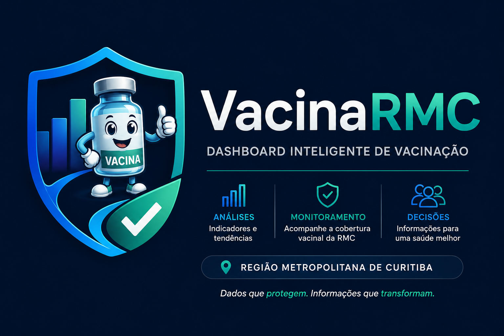

<p align="center">
  
</p>

<h1 align="center">VacinaRMC</h1>

<p align="center">
<b>Dashboard Inteligente de Vacinação</b><br>
Dados que protegem. Informações que transformam.
</p>

<p align="center">


</p>

---

# 📖 Sobre o Projeto

O **VacinaRMC** é um Dashboard Inteligente de Vacinação desenvolvido em **Power BI**, criado como Projeto Interdisciplinar do curso de Gestão da Tecnologia da Informação do **Instituto Federal do Paraná (IFPR) – Campus Pinhais**.

O dashboard analisa a evolução da cobertura vacinal dos municípios da **Região Metropolitana de Curitiba (RMC)** utilizando dados públicos do Ministério da Saúde e do IPARDES.

Além da cobertura vacinal, o projeto integra dados sobre a entrada de estrangeiros na região, permitindo análises complementares sobre possíveis fatores relacionados à variação dos índices de vacinação entre os anos de **2019 e 2024**.

---

# 🎯 Objetivos

- Monitorar a cobertura vacinal da Região Metropolitana de Curitiba;
- Comparar indicadores entre municípios;
- Visualizar a evolução da vacinação ao longo dos anos;
- Identificar municípios com cobertura crítica;
- Integrar dados de vacinação e estrangeiros;
- Apoiar gestores e profissionais da saúde na tomada de decisão.

---

# 🚀 Funcionalidades

### 📊 Indicadores

- Cobertura Vacinal Média
- Maior Cobertura
- Menor Cobertura
- Cobertura Crítica
- Classificação da Cobertura

### 📈 Visualizações

- Mapa Interativo da Região Metropolitana de Curitiba
- Evolução da Cobertura Vacinal
- Comparação entre Municípios
- Comparação por Vacina
- Indicadores (KPIs)

### 🔍 Filtros

- Município
- Vacina
- Ano

---

# 🛠 Tecnologias Utilizadas

- Power BI Desktop
- Power Query
- Microsoft Excel
- Figma
- GitHub

---

# 📂 Estrutura do Projeto

```text
Cobertura_Vacinal
│
├── dashboard/
│   └── Dashboard.pbix
│
├── dados/
│
├── documentacao/
│   ├── Projeto_Interdisciplinar_II.pdf
│   ├── gestao_monitoramento_sprint1.md
│   ├── gestao_monitoramento_sprint2.md
│   ├── gestao_monitoramento_sprint3.md
│   ├── gestao_monitoramento_sprint4.md
│   └── Relatorio_Desempenho_Sprint4.md
│
├── imagens/
│   └── logo_vacinaRMC.png
│
└── README.md
```

---

# 📑 Documentação

Toda a documentação do projeto encontra-se na pasta **documentacao**.

- Sprint 1
- Sprint 2
- Sprint 3
- Sprint 4
- Relatório de Desempenho
- Projeto Interdisciplinar II

---

# 📊 Fontes dos Dados

Os dados utilizados são provenientes de bases públicas:

- Ministério da Saúde
- InfoMS
- IPARDES
- Dados Abertos do Paraná

---

# 📌 Metodologia

O projeto foi desenvolvido utilizando:

- Design Thinking
- Scrum
- Product Backlog
- Daily Scrum
- Sprint Review
- Sprint Retrospective

---

# 📈 Dashboard

O dashboard permite:

- Visualizar a evolução da cobertura vacinal;
- Comparar indicadores entre municípios;
- Filtrar por vacina e período;
- Identificar municípios com cobertura abaixo da meta;
- Analisar dados relacionados à população estrangeira na RMC.

---

# 🎓 Projeto Acadêmico

Projeto desenvolvido como requisito da disciplina **Projeto Interdisciplinar II**, do Curso Superior de Tecnologia em Gestão da Tecnologia da Informação do **Instituto Federal do Paraná (IFPR) – Campus Pinhais**.

---

# 👩‍💻 Autora

**Katia Dhaem**

Curso Superior de Tecnologia em Gestão da Tecnologia da Informação

Instituto Federal do Paraná – Campus Pinhais

---

<p align="center">

### VacinaRMC

**Dashboard Inteligente de Vacinação**

Dados que protegem. Informações que transformam.

</p>
